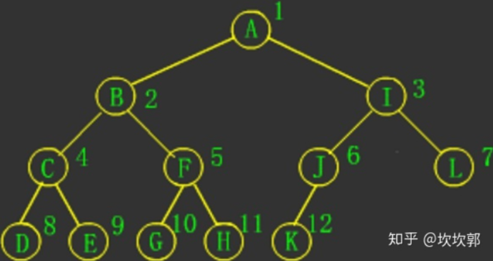
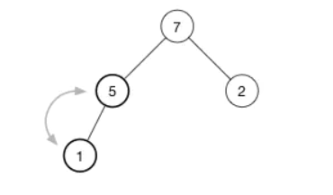

# Algorithm

This is my ropo for algorithm Solutions.

# Hot100 分类

## 1.哈希

1. （1）两数之和（Map 存储；排序）。
2. （49）字母异位词分组（排序比较；字母计数）。
3. （128）最长连续序列（利用哈希表，从最小的开始算）。

## 2.双指针

1. （283）移动零（双指针，快指针找非 0，慢指针挪位置）。
2. （11）盛水最多的容器（左右指针夹逼 + 贪心，比我高的我才计算）。
3. （15）三数之和（排序，利用等于去重，左右指针夹逼 + 等于去重，有点二分查找的感觉）。

## 3.滑动窗口

1. （3）无重复字符的最长子串（滑动窗口，从字符集，也就是哈希集合的角度考虑问题，记录每个字符是否出现过，只要发现 set 里面有重复，那么就一直让左指针去移动）。
2. （438）找到字符串中所有字母异位词分组（滑动窗口，记录每个字母出现的次数，然后使用 `Arrays.equals` 进行比较）。

## 4.子串/子数组

1. （560）和为 K 的子数组（前缀和，哈希表记录前缀和出现的次数，注意保存 0）。

## 5.普通数组

1. （53）最大子数组和（前缀和，找最小的前缀和，注意区分**当前**的前缀和与**过往**前缀和的最小值；动态规划，考虑 `nums[i]` 单独成为一段还是加入 `f(i−1)` 对应的那一段，主要是明白 `f[i]` 的含义，以 `nums[i]` 结尾的，如果考虑 `f[i] = max(f[i - 1] + nums[i], f[i - 1])` 的话，就不是以 `nums[i]` 结尾了）。

> 前缀和的关键词的是**连续**。

2. （56）合并区间（按照左端点排序，记着考虑 `[[1, 4], [2, 3]]` 的情况）。
3. （189）轮转数组（一维数组轮转；O(1) 空间复杂度的方法使用三次 reverse 即可解决）。
4. （238）除自身以外数组的乘积（前缀积，后缀积，左右开弓；O(1) 空间复杂度的方法可以利用 res 数组，后缀积需要单独定义一个变量 R）。

## 6.矩阵

1. 矩阵置零（用两个标记数组分别记录每一行和每一列是否有零出现；O(1) 的解法是使用输入 **matrix** 的第一行与第一列记录是否有零出现，然后额外使用两个标记变量分别记录第一行和第一列是否原本包含 0）。
2. 螺旋矩阵（定义变量用来记录遍历了多少，定义变量用来记录是否遍历过，然后定义四个方向 `[row, col]` 进行循环；O(1) 的方法是使用四个变量来记录边界）。
3. 旋转图像（可以找到规律为：对于矩阵中第 i 行的第 j 个元素，在旋转后，它出现在第 j 行倒数第 i 列的位置，要注意赋值顺序，`[i][j]` 为逆时针，`[i][j]` 在后为顺时针；第二种方法是先上下翻转，然后主对角线翻转）。
4. 搜索二维矩阵 II（左下角或者右上角起手，根据大小定方向）。

## 7.链表

1. 相交链表（A + B = B + A，重点是两个链表要互相**换链**）。

   > 核心在于 A 链表 + B 链表与 B 链表 + A 链表必然是相同的长度，所以一定会同时遍历到结尾。
   >
   > 这样的两个叠加链表同时遍历到有相同节点的时候，一定一边是 A 链表一边是 B 链表（因为题目保证没有环）。而相交节点开始到结尾的节点都相同，所以第一个相同的节点就是 A 链表和 B 链表的交点。

2. 反转链表（迭代解法，**存前取后**；递归解法，遍历到最后一个节点再进行处理，需要有一个节点存储最新的头节点，需要一个 helper 函数）。

3. 回文链表（存储到数组里面然后左右指针对比；快慢指针找到中点，反转后半段链表，然后做双指针顺序比对）。

4. 环形链表（快慢指针；单指针 + 哈希表）。

5. 环形链表 II（快慢指针，快指针走两步，慢指针走一步，相遇后，快指针回到起点，两个指针都走一步，再次相遇的地方就是环的入口；单指针 + 哈希表）。

6. 合并两个有序链表（双指针有序合并，学会使用 DummyNode + curNode）。

7. 两数相加（模拟加法，注意进位；空间复杂度为 O(1) 的解法是使用原链表）。

8. 删除链表的倒数第 N 个结点（双指针，引入 dummy 节点，方便删除头结点）。

9. 两两交换链表中的节点（递归，理解交互链表中的两个节点是什么意思；迭代可使用 dummy 节点，虽然要交换两个节点，但是需要三个 ListNode 变量）。

10. 随机链表的复制（哈希表，使用 hashmap 建立原始节点和新节点的映射，先 next，再 random；节点拆分，我们首先将该链表中每一个节点拆分为两个相连的节点，例如对于链表 A -> B -> C，我们可以将其拆分为 A -> A' -> B -> B' -> C -> C'。对于任意一个原节点 S，其拷贝节点 S' 即为其后继节点）。

11. 排序链表（归并排序，递归，需要合并两个有序链表子方法；迭代也可以完成，主要依靠 subLength，此处不使用该方法）。

12. **LRU 缓存**（Map + 双向链表，注意事项：capacity、map、dummy、tail，注意 next 是否为 null 的情况，从而更新 tail）。

## 8.二叉树

1. 二叉树的中序遍历（递归；迭代，显示维护一个栈，双 while 循环 -> 中序遍历始终先跑完左节点）。

2. 二叉树的最大深度（递归，左右子树的最大深度 + 1）。

3. 翻转二叉树（递归，交换两棵子树的位置，即完成以 root 为根节点的整棵子树的翻转）。

4. 对称二叉树（递归，模拟出两棵树来，然后两棵树的左右子树互相相等；迭代，引入队列，两两比较是否相等）。

5. 二叉树的直径（递归，计算左右子树的深度，然后求最大值）。

6. 二叉树的层序遍历（迭代，队列秒了）。

7. 将有序数组转化为二叉搜索树（递归，取中点构建平衡的二叉搜索树）。

8. 验证二叉搜索树（利用二叉搜索树的特性 => 递归，定义上下限，上下限均为 `node.val`；或者递归，使用 Map 存储子树的最大值 or 最小值；迭代，二叉搜索树的中序遍历是递增数组，因此可以中序遍历获取来判断，注意 `root != null` 的判断）。

9. 二叉搜索树中第 K 小的元素（迭代，中序遍历；递归，使用 Map 来统计以 node 为根结点的子树的结点数，然后使用二分法寻找第 K 小的元素，记得更新 right 时，对 K 进行同步更新）。

10. 二叉树的右视图（迭代，层序遍历）。

11. 二叉树展开为链表（递归，如果左子树不为空，将左子树插入到右子树的前面）。

12. 从前序和中序遍历中构造二叉树（递归，对于任意一颗树而言，前序遍历的形式总是 `[ 根节点, [左子树的前序遍历结果], [右子树的前序遍历结果] ]`，中序遍历总是 `[ [左子树的中序遍历结果], 根节点, [右子树的中序遍历结果] ]`）。

    

13. 路径总和 III（递归，前缀和，前缀和由两部分算法组成，**前序和与现节点和**）。

14. 二叉树的最近公共祖先（递归，存储父节点，可以用哈希表存储所有节点的父节点，然后我们就可以利用节点的父节点信息从 p 结点开始不断往上跳，并记录已经访问过的节点，再从 q 节点开始不断往上跳，如果碰到已经访问过的节点，那么这个节点就是我们要找的最近公共祖先）。

## 9.图论

1. 岛屿数量（递归，深度优先搜索，最终的岛屿数量就是进行深度优先搜索的次数；递归 + 队列，广度优先搜索，使用 index 存储当前岛屿的位置，化二维为一维，最终的就是进行广度优先搜索的次数）。
2. 腐烂的橘子（多源 BFS，多源 BFS 只需要把所有的 BFS 入队即可，BFS 的次数就是最小分钟数，注意最后一轮没有新鲜橘子腐烂）。
3. 课程表（拓扑排序，从入度的角度考虑问题，本质是一个 BFS）。
4. 实现 Trie（前缀树，思路其实很明确，指向子节点的指针数组 **children**，布尔字段 **isEnd**，表示该节点是否为字符串的结尾，最终的实现可以使用递归，也可以使用迭代，做法都是逐个逐个取字符）。

## 10.回溯

> 回溯问题常见的一个场景是防止重复，以下总结了常见的防止重复的方法：
>
> * 最终的答案里交换顺序属于同一种情况——**不回头式**搜索（或者说叫做顺序搜索，又分为自身可重复和自身不可重复两大类）。
> * 最终的答案里元素的个数相同属于同一种情况——**排序**聚集相同元素。
> * 元素只能被使用一次——使用**额外空间辅助记录**（数组、map 等）。
>
> 回溯算法就是个多叉树的遍历问题，关键就是在前序遍历和后序遍历的位置做一些操作，算法框架如下：
>
> ```python
> def backtrack(...):
>     for 选择 in 选择列表:
>         做选择
>         backtrack(...)
>         撤销选择
> ```
>
> 回溯的终止条件也很重要！

1. 全排列（递归，回溯模板解法，注意需要使用 Map 记录防止重复）。
1. （78）子集（递归，回溯模板解法，每一个结果都要保存；递归，选取 or 不选取，终止模板是 cur == n）。
1. 电话号码的字母组合（递归，回溯模板解法，不要在循环内使用 String += String，直接使用 StringBuilder 就可）。
1. 组合总和（递归，先排序做好剪枝，从 index 开始，防止回头式搜素导致组合重复，由于可以元素重复，递归时 index 传入 i）。
1. 括号生成（递归，选取左括号 or 选取右括号，做好剪枝 left <= right，终止条件是左右括号数均为 0）。
1. 单词搜索（递归，非回溯模板解法，但仍然是回溯，需要在回溯过程中适时终止【注意，BFS 本身做不到回溯】）。
1. 分割回文串（递归，回溯模板解法，需要提取一个判断是否回文串的子函数）。

## 11.二分查找

这里给一个二分查找的板子解法：

```java
public int search(int[] nums, int target) {
      if (nums.length == 0) return -1;
      int start = 0, end = nums.length - 1;

      while (start + 1 < end) {
          int mid = start + (end - start) / 2;
          if (target == nums[mid]) return mid;
          else if (target > nums[mid]) start = mid;
          else end = mid;
      }

      if (nums[start] == target) return start;
      if (nums[end] == target) return end;
      return -1;
  }
```

四点关键理解：

* start + 1 < end：

> start < end 代表 start 和 end 相遇就破坏循环，start <= end 代表 start 和 end 跨过去才破坏循环，而最后我们选取的 start + 1 < end 则表示 start 恰巧在 end 前面的时候（即相邻的时候）就破坏循环。
>
> 这样做的好处是永远也不会死循环（而 start <= | < end 是可能会死循环的，因为 mid 取了 start 或者 end），**当这个循环还在执行的时候，即 start 和 end 之间还有数字的时候，mid 的取值一定不会是 start 或者 end**。
>
> 在这种情况下，当 while 循环被破坏掉的时候，start 和 end 只会有两种情况 =>
>
> * start === end，只有可能出现在一开始 start 就和 end 相等的情况下。
> * start + 1 === end。

* start + (end - start) / 2：

> 传统的做法是 (start + end) / 2，相较于 start + (end - start) / 2，后者能够防止数字的溢出错误。

* start = mid 和 end = mid：

> 传统的做法是 start = mid + 1 和 end = mid - 1，为什么这里不需要 +1 和 -1 呢？我们需要承认的是，这个地方是可以 +1/-1 的（找等于 target 的题目时），但是不进行 +1/-1 会使模板的**普适性**更强一些。
>
> 事实上，很多题目在 start = mid 处是不能够 +1 的，比如我们不是找和  target 相等的位置，而是去找第一个比 target 小的数，此时就不能去 +1 或者 -1 了。

* **nums[start] : nums[end] ? target**：

> 在循环被破坏之后，最终的结果就只有可能位于 nums[start] 和 nums[end] 这两个数之间了，我们只需要挨个去判断即可。

1. 搜索插入位置（二分查找，插入最后一个比 target 小的元素后面，因此当 target == nums[mid] 时，还应当让继续向左搜索，注意最后两个元素的处理）。
2. 搜索二维矩阵（二分查找，直接化二维为一维即可）。
3. 在排序数组中查找元素的第一个和最后一个位置（两次二分查找，做法类似于“搜索插入位置”）。
4. 搜索旋转排序数组（二分查找，寻找分界点之后【寻找分界点的算法可以记忆一下，`target` 是 `nums[end]`】，对存在 target 的一侧进行二分查找；直接进行二分查找，丢弃不可能存在的一侧，这个更加简单）。

> 关于最后一个 ... 或者第一个 ... 问题，不应该从二分查找的数值逼近（mid > target，那么就让 mid 变小）的角度去分析是 `left = mid` 还是 `right = mid`，而应该从我怎么样操作，才能满足 mid 逼近于最后一个或者第一个的要求。

5. 寻找旋转排序数组中的最小值（二分查找，寻找分界点的算法）。

## 12.栈（字符串编解码）

1. 有效的括号（使用栈去完成，最后的判别条件是栈是否为空，穷举括号类型即可）。
2. 最小栈（定义一个辅助最小栈，pop 时同时 pop，push 时进行比较后，push 较小的那一个；一个栈保存；也可以直接一个栈去完成，入栈时直接保存元组【x, min(此前栈内最小值， x))】，出栈时直接 pop 元组）。
3. 字符串解码（同样使用栈来解决这个问题，关键是出栈逻辑，如果当前的字符为右括号，开始出栈，一直到左括号出栈，出栈序列反转后拼接成一个字符串，此时取出栈顶的数字【此时栈顶一定是数字】，就是这个字符串应该出现的次数，我们根据这个次数和字符串构造出新的字符串并进栈【注意翻转时，只能将 12, 23, 34 翻转为 34, 23, 12，而不能是 43, 32, 21】）。
4. 每日温度（单调栈【可以维护一个存储下标的单调栈，从栈底到栈顶的下标对应的温度列表中的温度依次递减】，压栈直接压两个元素就好【value, index】，或者只压 index，然后通过 index 找原始值）。

## 13.堆（数组中第 k 个最大元素）

1. 数组中第 k 个最大元素（使用最大堆，可使用 Java PriorityQueue，但是也可以**自建最大堆**，自建堆使用数组）。
1. 前 k 个高频元素（使用最大堆，借助 Map 统计每一个 nums[i] 出现的次数，然后使用出现次数建立最大堆，`PriorityQueue` 可以传入比较函数）。

## 14.贪心算法

1. 买卖股票的最佳时机（贪心，记录历史最低点的股票数字，然后进行一次遍历）。
2. 跳跃游戏（贪心，依次遍历数组中的每一个位置，并实时维护**最远可以到达的位置**；动态规划，`dp[i]` 表示能不能跳到第 i 个位置，转移方程为 `dp[j] = OR(dp[i] AND i + a[i] >= j)`）。
3. 跳跃游戏II（贪心，贪心贪的不是 `nums[i]`，贪的是 `nums[i]+i`，即立足于位置 i，能跳的**最远的地方**；动态规划，思路和跳跃游戏 I 的思路一样，`dp[i]` 表示到达第 `i` 个位置的最小跳跃次数）。
4. 划分字母区间（贪心，保存好每个字符在字符串中出现的最后位置，然后通过变量 end 记录子串中所有字符的最后位置）。

## 15.动态规划

1. 爬楼梯（动态规划板子题，考虑最后一步的转移方程为 `dp[i] = dp[i - 1] + dp[i - 2]`）。
2. 杨辉三角（模拟，直接按照杨辉三角的定义去生成，`c[i][j]=*c[i−1][j−1]+c[i−1][j]`，感觉不像 dp）。
3. 打家劫舍（动态规划模板题，弄清楚 `dp[i]` 是前 `i` 间房屋还是第 `i` 间房屋）。
4. 完全平方数（动态规划，转移方程是 OR[0, 1, ..., i] 枚举，有点类似于跳跃游戏）。
5. 零钱兑换（动态规划，类似于跳跃游戏，双重循环转态转移）。
6. 单词拆分（动态规划，类似于跳跃游戏，双重循环转态转移，dp[i] 定义为前 i 个字符）。
7. 最长递增子序列（动态规划，双重循环转态转移，记住最后的结果不是 `dp[nums.length - 1]`，而是 `max(dp[i])`，要结合题意理解；[贪心 + 二分查找](https://writings.sh/post/longest-increasing-subsequence-revisited#%E4%BA%8C%E5%88%86%E6%B3%95%E6%B1%82%E9%95%BF%E5%BA%A6)，时间复杂度是 O(nlogn)，需要一个数组 p，p 的每一项 `p[i]` 的含义是，所有长度为 i + 1 的上升子序列的末尾元素中的最小值，【一个新员工一个老员工价值相当，老员工就可以走了，因为新员工被榨取的剩余空间更多】、【要让序列上升的更慢，才能找到更长的递增子序列 】）。
8. 乘积最大子数组（思路与最大子序和相似，需要分正负讨论，注意最后的结果不是 `dp[nums.length - 1]`，而是 `max(dp[i])`）。
9. 分割等和子集（转化为背包型动态规划，关键包括问题的定义、初始情况和边界条件，背包问题的状态转移方程考虑**装得下**或者**装不下**）。

## 16.多维动态规划

1. 不同路径（动态规划板子题，easy，使用滚动数组进行优化）。
2. 最小路径和（动态规划，与不同路径的解法相似，滚动数组不能简单替换，尤其在边界条件下，**记得每一列都滚动替换**）。
3. 最长回文子串（动态规划，遍历的顺序是 `[长度][左起点]`，另外一个关键是弄清楚 `dp[i][j]` 的含义，是 substr，还是 [i, j]）。

> 动态规划的关键点，弄清楚变量的定义（前 or 不前）、dp 长度是 n 还是 n + 1（后者做初始化会更加简单一些）、转移方程的遍历方向、最后的结果是 `dp[n]` 还是 `max(dp[i])`。

4. 最长公共子序列（动态规划，滚动数组优化，`dp[i][j]` 定义的是 `t1[0, i]` 和 `t2[0, j]` 的最长公共子序列，转移方程如下 =>

   

5. 编辑距离（动态规划，滚动数组优化，主要思路是尝试让 A 的最后一个字符变成 B 的最后一个字符，最终的条件有四个，需要理解并记忆，参考《动规六》，转移方程如下 =>

   

## 17.技巧

1. 只出现一次的数字（使用**异或**的位运算，任何数和其自身做异或运算，结果是 0，异或运算满足**交换律和结合律**）。
2. 多数元素（摩尔投票法，候选人 (cand_num) 初始化为 `nums[0]`，票数 count 初始化为 1。当遇到与 cand_num 相同的数，则票数 count = count + 1，否则票数 count = count - 1。当票数 count 为 0 时，更换候选人，并将票数 count 重置为 1。遍历完数组后，cand_num 即为最终答案）。
3. 颜色分类（记录三种颜色各有多少个即可，类似于桶排序，O(n) 时间复杂度，O(1) 空间复杂度）。
4. 下一个排列（对于一个整数序列，首先找到其从后往前的第一个 (小，大) 的那个 "大" 的下标，然后 index-- 找到那个 “小” 的下标（注意处理 index = -1 的情况），然后从 index + 1 到 nums.length - 1 从后往前寻找到第一个比 index 大的进行交换，之后整个序列进行 reverse）。
5. 寻找重复数（使用环形链表，首先需要将数组建模成链表——`i -> nums[i]`，数组中有一个重复的整数 <==> 链表中存在环，找到数组中的重复整数 <==> 找到链表的环入口）。

# Max300 分类


# 附录

## 1.动态规划概览

### 1.1.什么情况下使用动态规划

一般情况下，使用动态规划的三个场景：

1. 求最大值或者最小值。
2. 判断是否可行。
3. 统计方案个数。

一般情况下，不使用动态规划的两个场景：

1. 求出所有具体的方案而非方案的个数。
2. 输入数据是一个集合而不是序列。

> 什么是序列？一种数据结构，数据按顺序排列，序列中数据的顺序是十分重要的。
>
> 什么是集合？一种数据结构，数据之间没有什么关系，仅仅是聚合在一起。

### 1.2.动态规划的思路

动态规划其实就是**带备忘录的递归**。

做动态规划，要学会定义**子问题**，子问题要保证无后效性。什么是动态规划的无后效性？为了保证计算子问题能够按照顺序、不重复地进行，动态规划要求已经求解的子问题不受后续阶段的影响。这个条件也被叫做「无后效性」。

因此，考虑动态规划的转移方程时，需要明白：

* 首先一定要把前面的计算结果利用起来（分解子问题）。
* 然后**考虑一个新的元素加进来之后**，如何结合前驱元素和结果计算新的结果（其实换句话说，就是从**最后一步**入手开始考虑）

## 2.堆

### 2.1.堆的定义

`堆`（`heap`），是一种数据结构，另外它也是一种特别的二叉树，满足以下条件的二叉树，可以称之为堆：

* 它是一颗完全二叉树，如下图所示：

  

* 每一个节点的值都必须大于等于或者小于等于其孩子节点的值。

堆的优势：

1. 插入和删除都是O(logn)。
2. 取最大值和最小值的时间为 O(1)。

根据父子节点值的关系，堆可以分为：

1. 最大堆（max-heap），子节点的值 <= 父节点。
2. 最小堆（min-heap），子节点的值 >= 父节点。

### 2.2.堆的特性

> 这里讨论的堆的特性主要是指最大堆和最小堆的性质。

堆分为两种：*最大堆*和*最小堆*，两者的差别在于节点的排序方式。

在最大堆中，父节点的值比每一个子节点的值都要大。在最小堆中，父节点的值比每一个子节点的值都要小。这就是所谓的“堆属性”，**并且这个属性对堆中的每一个节点都成立**。

根据这一属性，那么最大堆总是将其中的最大值存放在树的根节点。而对于最小堆，根节点中的元素总是树中的最小值。堆属性非常有用，因为堆常常被当做优先队列使用，因为可以快速地访问到“最重要”的元素。

> **注意：**堆的根节点中存放的是最大或者最小元素，但是其他节点的排序顺序是未知的。例如，在一个最大堆中，最大的那一个元素总是位于 堆顶的位置（或者说根节点），但是最小的元素则未必是最后一个元素。唯一能够保证的是最小的元素是一个叶节点，但是不确定是哪一个。

### 2.3.堆的实现

由于堆首先是一个完全二叉树，因此使用数组实现堆就是一个很自然的想法。这种实现方式在时间和空间上都是很高效的。

借助完全二叉树的父子关系和数组下标的映射，我们就能利用下面的公式给出某个节点的父节点和左右子节点在数组中的下标：

```java
parent(i) = floor((i - 1)/2)
left(i)   = 2i + 1
right(i)  = 2i + 2
```

> 注意 `right(i)` 就是简单的 `left(i) + 1`。左右节点总是处于相邻的位置。

在最大堆中，父节点的值总是要大于（或者等于）其子节点的值。这意味下面的公式对数组中任意一个索引 `i`都成立：

```java
array[parent(i)] >= array[i]
```

在堆中，在当前层级所有的节点都已经填满之前不允许开是下一层的填充，所以堆总是有这样的形状：


如果一个堆有 n 个节点，那么它的高度是 *h = floor(log2(n))*。这是因为我们总是要将这一层完全填满以后才会填充新的一层。上面的例子有 15 个节点，所以它的高度是 `floor(log2(15)) = floor(3.91) = 3`。

### 2.4.堆的插入和删除

我们通过一个插入例子来看看插入操作的细节。我们将数字 `16` 插入到这个堆中：


堆的数组是： `[ 10, 7, 2, 5, 1 ]`。

第一股是将新的元素插入到数组的尾部。数组变成：

```js
[ 10, 7, 2, 5, 1, 16 ]
```

相应的树变成了：


`16` 被添加最后一行的第一个空位。不行的是，现在堆属性不满足，因为 `2` 在 `16` 的上面，我们需要将大的数字在上面（这是一个最大堆）。为了恢复堆属性，我们需要交换 `16` 和 `2`：


现在还没有完成，因为 `10` 也比 `16` 小。我们继续交换我们的插入元素和它的父节点，直到它的父节点比它大或者我们到达树的顶部。这就是所谓的 **shift-up**，每一次插入操作后都需要进行。它将一个太大或者太小的数字“浮起”到树的顶部。最后我们得到的堆：


现在每一个父节点都比它的子节点大。

### 2.5.堆的删除

> 堆删除任意一个节点的步骤和删除根节点的步骤大同小异，毕竟递归地看，其他节点也只是某个更小的堆的根节点。这里只给出删除堆的根节点的过程。

我们将这个树中的 `(10)` 删除：


现在顶部有一个空的节点，怎么处理？


当插入节点的时候，我们将新的值返给数组的尾部。现在我们来做相反的事情：我们取出数组中的最后一个元素，将它放到树的顶部，然后再修复堆属性。


现在来看怎么 **shift-down** `(1)`。为了保持最大堆的堆属性，我们需要树的顶部是最大的数据。现在有两个数字可用于交换 `7` 和 `2`。我们选择这两者中的较大者称为最大值放在树的顶部，所以交换 `7` 和 `1`，现在树变成了：


继续堆化直到该节点没有任何子节点或者它比两个子节点都要大为止。对于我们的堆，我们只需要再有一次交换就恢复了堆属性：



## 3.快速排序 & 归并排序

快速排序模板：

```java
class Solution {
  	public int[] sortArray(int[] nums) {
        // 快速排序。
        // 首先进行乱序。
        int len = nums.length;
        for (int i = 0; i < nums.length; i++) {
            int random = (int) (Math.random() * (len - i)) + i;
            int temp = nums[i];
            nums[i] = nums[random];
            nums[random] = temp;
        }

        helper(nums, 0, nums.length - 1);
        return nums;
    }

    public void helper(int[] nums, int left, int right) {
        if (left >= right) return;
        int l = left, r = right;
        int temp = nums[left];
      	// 这边必须是 left（right，这是配套的）。
  			// 这是为了防止源数据有序时发送错误交换，因为下面只要 nums[l] <= temp 就会继续 while。
        while (l < r) {
          	// 必须是相等时结束，这样才能找到那个 index。
            while (l < r && nums[r] >= temp) r--;
          	// 这边必须是先 r--（l++，这是配套的）。
          	// 先 r-- 是为了保证最后的 nums[l] 是比 temp 小的。
            while (l < r && nums[l] <= temp) l++;
            if (l < r) {
                int t = nums[l];
                nums[l] = nums[r];
                nums[r] = t;
            }
        }
        nums[left] = nums[l];
        nums[l] = temp;

        helper(nums, left, l - 1);
        helper(nums, l + 1, right);
    }
}
```

归并排序模板：

```java
class Solution {
  	public int[] sortArray_2(int[] nums) {
        // 归并排序。
        return helper_2(nums, 0, nums.length - 1);
    }

    public int[] helper_2(int[] nums, int left, int right) {
        if (left >= right) return new int[]{nums[left]};

        int mid = left + (right - left) / 2;
        int[] nums1 = helper_2(nums, left, mid);
        int[] nums2 = helper_2(nums, mid + 1, right);

        int[] res = new int[nums1.length + nums2.length];
        int p1 = 0, p2 = 0, cur = 0;
        while (p1 < nums1.length && p2 < nums2.length) {
            if (nums1[p1] <= nums2[p2]) {
                res[cur] = nums1[p1];
                p1++;
            } else {
                res[cur] = nums2[p2];
                p2++;
            }
            cur++;
        }
        while (p1 < nums1.length) res[cur++] = nums1[p1++];
        while (p2 < nums2.length) res[cur++] = nums2[p2++];
        return res;
    }
}
```

二者的区别：

1. 快速排序和归并排序二者都是 `O(nlogn)` 的时间复杂度，只不过前者的时间复杂度是一个期望值，其在最坏情况下会出现 `O(n^2)` 的时间复杂度。而后者在最好、最坏情况下的时间复杂度均为 `O(nlogn)`，因为归并排序是分治思路，上来不管三七二十一直接一刀两半，降低问题规模。
2. 快速排序是一个需要 O(1) 额外空间的排序算法，它是一个原地排序，但是归并排序则是一个需要 O(n) 额外空间的排序算法。而且归并创建 O(n) 额外空间的做法又在一定程度上影响了它的时间表现（创建及回收空间都是要花时间的）。
3. **快速排序不是一个稳定的排序算法，而归并排序则是一个稳定的排序算法**。
4. 快速排序是一个先整体有序，再局部有序的算法，而归并排序则是先局部有序，再整体有序的算法。

## 4.背包问题专题（抽象成背包问题的关键就是有没有容量）

> 参考：https://mp.weixin.qq.com/s/xmgK7SrTnFIM3Owpk-emmg。
>
> 虽然感觉三叶的笔记更加成体系，但是理解难度也更大，我这里选择九章的理解。

* 0-1 背包问题（一个物品只能拿一次）：一般开二维数组，双重循环都是从前向后遍历，`dp[i][j]` 表示前 i 个物品，能够拼出重量 j 的最大价值。
* 完全背包问题（一个物品可以拿无限次）：一般开一维数据，双重循环都是从前向后遍历，`dp[i]` 表示拼出重量 `i` 的最大价值。

### 4.1.滚动数组优化

根据「转移方程」，我们知道计算第 i 行格子只需要第 i - 1 行中的某些值。

也就是计算「某一行」的时候只需要依赖「前一行」。因此可以用一个只有两行的数组来存储中间结果，根据当前计算的行号是偶数还是奇数来交替使用第 0 行和第 1 行。

**这种空间优化方法十分推荐，因为改动起来没有任何思维难度。**

**只需要将代表行的维度修改成 2，并将所有使用行维度的地方从 i 改成 i % 2 或者 i & 1 即可（更建议使用 i & 1，& 运算在不同 CPU 架构的机器上要比 % 运算稳定）。**

> 注意更新滚动数组中的 `dp[i & 1][0]`，因为有些边界情况可能不会更新到这个值。

